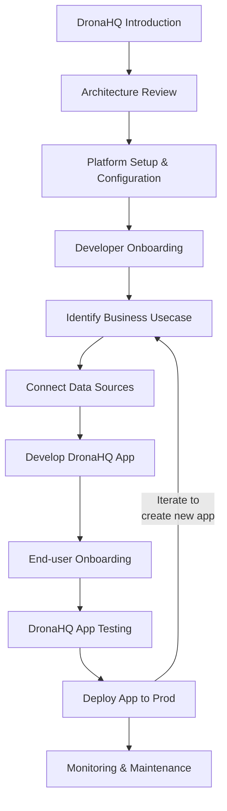
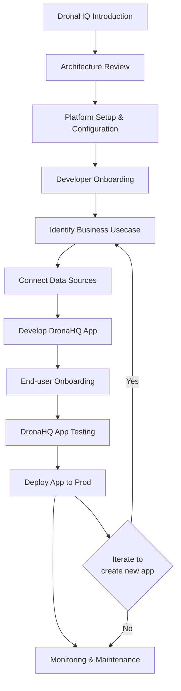

The goal is to showcase a customer journey within DronaHQ that empowers users to uderstand DronaHQ adoption with various roles at different stages, to build internal tools efficiently.

## Different Adoption Stages

1. #### Individual Users/Small Teams: 
    These users typically start with a single, specific application. DronaHQ offers an intuitive interface equipped with pre-built components, facilitating swift development. This enables them to quickly build and deploy their tools without the need for extensive technical expertise.
2. #### Growing Teams/Departments: 
    As teams expand and develop more applications, DronaHQ provides scalability features along with role-based access control. This ensures easy collaboration among team members while maintaining security and access privileges based on individual roles within the organization.
3. #### Enterprise Adoption: 
    As DronaHQ becomes adopted on a broader scale within an organization, it offers advanced administrative tools for centralized management. Integration with single sign-on (SSO) enhances user experience by providing a unified login mechanism across various platforms. Additionally, robust monitoring capabilities empower administrators to track usage metrics and ensure optimal performance and compliance across the enterprise environment.

## Key Roles

- #### DronaHQ Administrator: 
    Responsible for managing user access permissions and configurations within the DronaHQ environment. This role ensures the smooth operation of the platform by setting up and maintaining environments tailored to the organization's needs, thereby optimizing performance and usability.
- #### DronaHQ Developer: 
    Tasked with utilizing the features of DronaHQ to build internal tools efficiently. Developers leverage the platform's drag-and-drop interface to design applications, employ data binding techniques to link data sources to the application interface, and implement custom logic to enhance functionality according to business requirements.
- #### DronaHQ Maintainer: 
    This role focuses on ensuring the health and stability of the DronaHQ system. Maintainers monitor system performance, diagnose and resolve issues, and implement preventative measures to mitigate potential disruptions, thereby ensuring uninterrupted service for users.
- #### DronaHQ End-user: 
    As the beneficiary of the applications developed within DronaHQ, end-users interact with these tools to automate processes and streamline workflows. They utilize the functionalities provided by developers to accomplish tasks more efficiently, thereby enhancing productivity and driving organizational success.

## Enhancing the DronaHQ Experience


- Intuitive UI Construction: Implement a visual development environment with drag-and-drop functionality and pre-built UI components (e.g., buttons, forms, tables) for common user interface elements. This will expedite the application development process.

- Simplified Data Connectivity: Provide robust integration capabilities with various data sources, including relational databases and application programming interfaces (APIs). This will streamline data access and manipulation within internal tools.

- Empowered Data Visualization: Equip developers with tools to construct interactive dashboards and visualizations. These visualizations will enable users to gain deeper insights from the data within applications.

- Robust Scalability and Security: Ensure DronaHQ's architecture can accommodate a growing number of applications while enforcing role-based access control (RBAC). RBAC will guarantee secure collaboration by defining user permissions based on their roles within the team.

- Centralized Administration: For large-scale deployments, offer centralized administration tools for managing users, environments, and access control across the organization. This functionality will simplify DronaHQ management for IT teams.


## Customer Journey:



<!-- 

```mermaid
sequenceDiagram
    participant A as Introduction
    participant B as Architecture Review
    participant C as Platform Setup & Configuration
    participant D as Developer Onboarding
    participant E as End-user Onboarding
    participant F as Monitoring & Maintenance

    A->>B: Capabilities, Empower teams
    B->>C: Architecture, Data source integrations, Security
    C->>D: Documentation, Training, Secure setup
    C->>E: Functionalities, Security practices, Best practices
    D->>D: Strategy, Training materials
    D->>F: Monitoring, Health, Performance

``` -->


### DronaHQ Introduction
Role: Administrator

Focus: Managing user access, environments, and overall platform health.

Stages:
  1. Setup & Configuration:
     - Complete Administrator training.
     - Collaborate with the Architect.
     - Manage user access and permissions.
  2. Ongoing Management:
     - Manage user requests.
     - Monitor platform activity.
     - Back up data regularly.

### Architecture Review
Role: Administrator

Focus: Reviewing and finalizing the platform architecture.

Stages:
  1. Planning & Design:
     - Understand organizational needs.
     - Complete DronaHQ Architect training.
     - Design architecture.

### Platform Setup & Configuration
Role: Administrator

Focus: Setting up and configuring the DronaHQ platform.

Stages:
  1. Implementation & Security:
     - Set up the platform.
     - Implement security measures.
     - Configure monitoring tools.

### Developer Onboarding
Role: Administrator and Developer

Focus: Bringing developers onto the platform and ensuring they are ready to work.

Stages:
  1. Introduction:
     - Attend platform overview sessions.
     - Learn development tools.
  2. Training:
     - Participate in onboarding programs.
     - Collaborate to identify use cases.

### Identify Business Usecase
Role: Developer

Focus: Determining the specific business requirements and use cases for the application.

Stages:
  1. Analysis:
     - Understand business needs.
     - Document requirements.
  2. Planning:
     - Plan application features.
     - Align with business goals.

### Connect Data Sources
Role: Administrator and Developer

Focus: Integrating data from various sources into the DronaHQ platform.

Stages:
  1. Integration:
     - Identify necessary data sources.
     - Set up connections.
  2. Configuration:
     - Configure data integrations.
     - Ensure data accuracy and integrity.

### Develop DronaHQ App
Role: Developer

Focus: Building the application using DronaHQ tools and features.

Stages:
  1. Development:
     - Use visual development environment.
     - Create application components.
  2. Collaboration:
     - Work with team members.
     - Use version control.

### End-user Onboarding
Role: Developer

Focus: Preparing end-users to effectively use the new application.

Stages:
  1. Training:
     - Conduct training sessions.
     - Provide user documentation.
  2. Support:
     - Offer ongoing support.
     - Collect user feedback.

### DronaHQ App Testing
Role: Developer and Administrator

Focus: Ensuring the application is fully functional and meets requirements.

Stages:
  1. Testing:
     - Perform functional testing.
     - Conduct performance testing.
  2. Validation:
     - Validate against business requirements.
     - Fix any identified issues.

### Deploy App to Prod
Role: Developer

Focus: Moving the application from development to production.

Stages:
  1. Preparation:
     - Prepare deployment plan.
     - Ensure all components are ready.
  2. Deployment:
     - Execute deployment.
     - Verify successful implementation.

### Monitoring & Maintenance
Role: Maintenance Team

Focus: Ongoing support and optimization of the deployed application.

Stages:
  1. Monitoring:
     - Monitor application performance.
     - Track usage metrics.
  2. Maintenance:
     - Perform regular updates.
     - Address any issues promptly.

### Repeat Steps for New App
Role: Developer

Focus: Iterative development for new applications.

Stages:
  1. Review:
     - Revisit business use cases.
     - Plan new application development.
  2. Implementation:
     - Follow established development process.
     - Ensure continuous improvement.


<!-- 

intro - administrator
arcchitext - adminis
Platform Setup & Configuration - adminis
Developer Onboarding - adminius/ deve
Identify Business Usecase - dev
Connect Data Sources - adminis || dev
[Develop DronaHQ App] - dev
[End-user Onboarding] - dev 
[DronaHQ App Testing] - dev/ a
[Deploy App to Prod] - dev
[Monitoring & Maintenance] - maint


## DronaHQ User Journey Stages
Certainly! Here's a structured representation of the user journeys for different roles in the DronaHQ ecosystem:

### DronaHQ Developer
- Focus: Creating and developing internal tools using DronaHQ.
Stages:
  1. Introduction:
     - Attend platform overview sessions.
     - Collaborate to identify use cases.
     - Learn development tools.
  2. Development & Collaboration:
     - Use visual development environment.
     - Integrate data from various sources.
     - Collaborate with version control.
  3. Deployment & Maintenance:
     - Deploy tools following procedures.
     - Monitor performance.
     - Adapt to new features.

### DronaHQ Architect
- Focus: Designing and implementing a secure and scalable DronaHQ architecture.
Stages:
  1. Planning & Design:
     - Understand organizational needs.
     - Complete DronaHQ Architect training.
     - Design architecture.
  2. Implementation & Security:
     - Set up the platform.
     - Implement security measures.
     - Configure monitoring tools.
  3. Maintenance & Optimization:
     - Monitor resource utilization.
     - Stay updated on security best practices.

### DronaHQ Administrator
- Focus: Managing user access, environments, and overall platform health.
Stages:
  1. Setup & Configuration:
     - Complete Administrator training.
     - Collaborate with the Architect.
     - Manage user access and permissions.
  2. Ongoing Management:
     - Manage user requests.
     - Monitor platform activity.
     - Back up data regularly.

### End-User
- Focus: Utilizing internal tools to improve work efficiency.
Stages:
  1. Adoption & Training:
     - Participate in training sessions.
     - Learn application features.
  2. Daily Usage:
     - Utilize applications for tasks.
     - Provide feedback for improvements.
     
 -->


## Additional Considerations:

* User-Centric Design: Conduct user research to understand the specific needs and preferences of your target audience within DronaHQ. This will ensure the platform aligns with user expectations and workflows.

* Iterative Development: Focus on building core functionalities first and then iterate based on user feedback and evolving requirements. This iterative approach allows for continuous improvement and ensures DronaHQ remains valuable to its users.

* Comprehensive Documentation: Provide clear and detailed documentation tailored for each user role (administrator, developer, end-user). This will facilitate smooth adoption of DronaHQ across the organization and empower users at all levels to leverage its potential effectively.


By combining these enhancements with user-centric considerations, you can create a truly exceptional DronaHQ experience that fosters efficient internal tool development and empowers users across the organization.