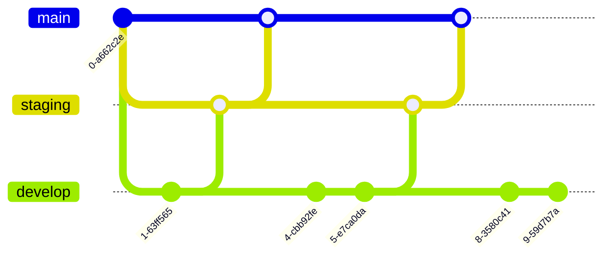

import Image from '@site/src/components/Image';
import Thumbnail from '@site/src/components/Thumbnail';

You can enable Git Sync globally to effectively manage version control for all your apps on DronaHQ by linking them to a Git hosting provider, like GitHub, GitLab, Bitbucket, and others in single Git repository. This integration simplifies the process of monitoring changes, facilitating rollbacks, and promoting collaborative work via git branches. Moreover, it allows for seamless connectivity to any app, whether it resides within the same account or another, enabling users to effortlessly transition between diverse environments.

:::info

For Git sync to work the user needs Git hosting service which supports PAT and currently it is available on self-hosted and not available on the cloud.

:::

## DronaHQ Git Sync Workflow

 <figure>
    <Thumbnail align = "center" src="/img/git-sync/git-sync-workflow.png" alt="GitHub SSH URL" />
    <figcaption align = "center"><i>Git Recommended Workflow</i></figcaption>
    </figure>

Here, Staging and Production instances are locked for editing. All App changes is done on Development instance and changes are pushed into dev branch in git. Merge request from dev branch should go into staging instance and you should sync all your apps in your staging instance. Once, your Staging instance is working as expected, you should then proceed with merging staging branch into main branch and sync All your Apps in Production instance.

### Git Workflow

## Prerequisite

To connect your apps on DronaHQ with Git, you must have a GitHub account, or any other version control accounts such as GitLab, Bitbucket, etc., and must have basic knowledge of git operations.

## New way to configue Global Git Sync 
Github has made decision to migration from SSH to Personal Access Tokens (PAT) based authentication. While SSH keys provide secure authentication, managing them can be complex, especially across multiple devices or teams. PATs offer finer-grained control with customizable scopes, allowing you to grant access only to specific actions or repositories, reducing risks. 

We are also migrating from old SSH to  PAT based authentication, and this is going to be available to you in self-host version `3.4.0-stable and greater`. 

### Create Personal Access Tokens (PAT)

You need to create PAT key in GitHub. Navigate to `Setting -> Developer Settings -> Personal access tokens`. Generate new token and configure the permissions as you like.

### Setting up New Git Sync Environment Variables

Below Environment variables to be configured -

| Environment Variable  | Description |
|----------------------------------------------|-----------------------------------------------------------------------------------------------------|
| GIT_SYNC                            | This variable specifies if you want to enable Global Git Sync feature. By default it is set to `false` |
| GIT_SYNC_REPOSITORY_URL             | HTTPS Url of the Git Repo which you want all your apps to be checked into. Mandatory if GIT_SYNC is true |
| GIT_SYNC_BRANCH_NAME                | Branch name of the above repo url which this instance should be synced with. For production instance, ideally use `main` branch.    |
| GIT_SYNC_PERSONAL_ACCESS_TOKEN      | Personal Access token generated on githug repository that you want to use to sync apps is placed here |
| GIT_SYNC_AUTO_SAVE                  | Enable this to automatically save your app changes to your GIT repo. |
| GIT_SYNC_ALLOW_EDIT                 | Enable this to allow editing of you app that is added to GIT. Ideally, you should set to `false` for your production instance and set it to `true` for your development instance. |
| GIT_SYNC_AUTO_ADD_NEW_RESOURCES     | Enable this to automatically add new apps to git. Ideally, you should set to `true` for your development instance if you want all apps to be automatically added to git and set it to `false` for your production instance. By default, it is set to `false`. |

## Old way to configue Global Git Sync 
If you are using `pervious self-host version than 3.4.0-stable` then you need to follow the old configuration to enable globl git sync feature.

### Create SSH Key in each DronaHQ Instance

You need to create SSH key in each of your DronaHQ instances. Navigate to `Profile -> Account Settings -> Integrations -> SSH Key Management -> + Add Key`. Provide a friendly name and `Generate & Save Key`. Make a note of the friendly name that will be required later for setting up environment variable and public key that will be required for setting up Git repository later.

### Setting up Old Git Sync Environment Variables

Below Environment variables to be configured -

| Environment Variable  | Description |
|--------|--------|
| GIT_SYNC_IS_GLOBAL            | This variable specifies if you want to enable Global Git Sync feature. By default it is set to `false` |
| GIT_SYNC_SSH_REPO_URL  | SSH Url of the Git Repo which you want all your apps to be checked into. Mandatory if GIT_SYNC_IS_GLOBAL is set to true. |
| GIT_SYNC_BRANCH_NAME       | Branch name of the above repo url which this instance should be synced with. For production instance, ideally use `main` branch.    |
| GIT_SYNC_AUTH_SSH_KEY_FRIENDLY_NAME | Friendly Key name you have used for creating SSH key from SSH Key management. The public key of this friendly key should be added in your GIT repo with read/write rights to above GIT Sync repo. |
| GIT_SYNC_IS_AUTO_SAVE | Enable this to automatically save your app changes to your GIT repo. |
| GIT_SYNC_IS_LOCK_APP_EDIT | Enable this to disable editing of you app that is added to GIT. Ideally, you should set to `true` for your production instance and set it to `false` for your development instance. |
| GIT_SYNC_CREATE_REPO_ON_APP_ADD | Enable this to automatically add new apps to git. Ideally, you should set to `true` for your development instance if you want all apps to be automatically added to git and set it to `false` for your production instance. By default, it is set to `false`. |

### Setup Git repo

Various Git providers are supported. For detailed instructions refer [here](#setting-up-on-supported-git-providers)
- Github
- Gitlab
- Bitbucket

### Setting up on supported Git providers

#### Adding SSH Keys to Git Service Accounts
1. To add this SSH key to your GitHub account, navigate to `GitHub > Settings > SSH and GPG Keys > New SSH key`.

2. Provide the required details, including a Title, and paste the SSH key copied from the app in DronaHQ. Click `Add SSH key`. Confirmation and a password prompt may follow.

:::info 
The default branch for the connection is main for GitHub.
:::

#### Adding SSH Keys to a particular GitHub Repository

This option is specially helpful for enterprise accounts which do not have access to `SSH & GPG Keys` option in your personal settings.

1. To add this SSH key to your GitHub repo, navigate to `GitHub -> Repository -> Settings -> Deploy Keys > Add deploy key`.

2. Provide the required details, including a Title, and paste the SSH key copied from the app in DronaHQ. Also enable `Allow write access` checkbox. Click `Add key`. Confirmation and a password prompt may follow.

#### Adding SSH Key in GitLab

1. To add this SSH key to your GitLab account, go to `GitLab > User Settings > SSH Keys`.

2. Provide the necessary details, such as Title and Expiry date, and paste the SSH key copied from the app in DronaHQ. Click `Add key`.

  

#### Adding SSH Key in Bitbucket

1. To add this SSH key to your Bitbucket account, visit `Bitbucket > Settings > SSH Keys (under security) > Add key`. Note that you need to add the key at the account level, not the repository level.

2. Provide the necessary details, including the Label, and paste the SSH key copied from the app in DronaHQ. Click `Add key`.

## Git Sync In Action 

### Add to Git

Add to Git option will check in the App's JSON in version control in the following location - `App -> <App Name> -> <App name>.json`. 
If `GIT_SYNC_IS_AUTO_SAVE` is set to true, any changes you perform in the app will be auto-saved into git with auto-commit message.

 
    <iframe 
        src="https://demo.arcade.software/C5Uj84xAqqRAQlYkHIXX?embed" 
        title="Add to Git" 
        frameborder="0" 
        loading="lazy" 
        webkitallowfullscreen 
        mozallowfullscreen 
        allowfullscreen 
        style= {{ position: 'absolute', top: 0, left: 0, width: '100%', height: '100%', colorScheme: 'light' }} >
    </iframe>

### Remove from Git

Removing from Git will delete the App's entire Folder from git.

 
    <iframe 
        src="https://demo.arcade.software/CRRDk1G34oxL5Swn4Ok1?embed" 
        title="Remove from Git" 
        frameborder="0" 
        loading="lazy" 
        webkitallowfullscreen 
        mozallowfullscreen 
        allowfullscreen 
        style= {{ position: 'absolute', top: 0, left: 0, width: '100%', height: '100%', colorScheme: 'light' }} >
    </iframe>

### Push changes to Git

Its recommended to set `GIT_SYNC_IS_AUTO_SAVE` environment variable to `true` so that any changes you make in your app is auto-committed into git.

### Pull changes from Git

In case, another user have made updates to the same app, DronaHQ will auto-detect the remote changes and will notify you of the remote changes and will ask you to take update before making any changes in the app. 

<figure>
    <Thumbnail src="/img/git-sync/pull-changes.png" alt="Git Pull Changes" />
    <figcaption align = "center"><i>Git Pull Changes</i></figcaption>
</figure>

Once the Changes has been pulled successfully, you will see `App pull Successful!` message.

### Sync Apps from Git Repo

When you have multiple instances setup, `Sync Apps` option enables you to sync all your Apps across instances (Newly added, Updated and Delete Apps) from a single overview sidebar.

 
    <iframe 
        src="https://demo.arcade.software/eLtQMCvdJeh2YEESi5EG?embed" 
        title="Sync Apps - Install & Release" 
        frameborder="0" 
        loading="lazy" 
        webkitallowfullscreen 
        mozallowfullscreen 
        allowfullscreen 
        style= {{ position: 'absolute', top: 0, left: 0, width: '100%', height: '100%', colorScheme: 'light' }} >
    </iframe>

Below are the various options available

#### APPS ADDED Section
1. **Install** option to add this app in current instance.
1. **Install & Release** option if this app has been published in other instance. This option will add this app in current instance and also publish it for end user.

#### APPS UPDATED Section
1. **Update** option to update this app in the current instance.
1. **Update & Release** option if this app has been modified and published in other instance. This option will update this app in current instance and also publish it for end user.

#### APPS DELETED Section
1. This section lists all the Apps deleted in other instance. You can use `Delete` option to remove this app from the current instance.

