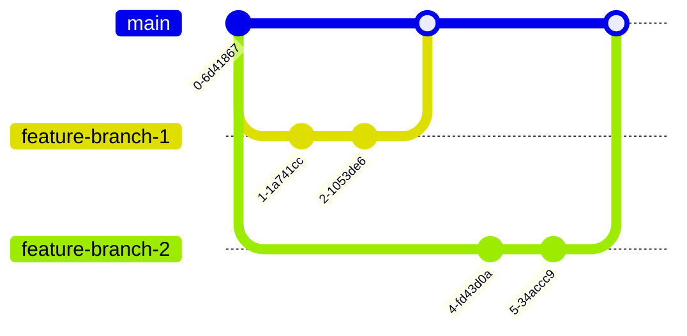

import Image from '@site/src/components/Image';
import Thumbnail from '@site/src/components/Thumbnail';

Protected Apps with Git restricts editing your Apps directly on your default git branch. This feature is available only when you have enabled [Git Sync](/git-sync-global) in your environment and only available for Apps that are added into Git.

:::info
Protected Apps feature is available on self-hosted and not available on the cloud. 
:::

## Protect App

In DronaHQ, to protect your app, go to the App in the App listing Page that is already added into Git and select `... -> Protect App`.

This option will be visible only to the App owner and Account owner.

### Git Workflow

## Create Branch and Make Changes

Click Edit and select `+ Create New Branch`. Give the branch a name that is descriptive based on your feature being built. You can also select `Allow collaboration` to allow other users to push changes to it.

Once you Protect this App, all your changes to this app will have to be done by creating feature branch and merging in your default branch.

After you create the branch, you can edit the App by opening the newly created branch of your App using - `Edit -> Select your Branch`'

:::info
You can Preview your App changes and Push it to Git in the respective branch. But, you can not Publish the Protected App from your Feature Branch. 
:::

## Save your Changes

After you have finish making changes, you need to push your changes to Git.

Click the Publish button dropdown in the top right corner and select `Push To Git` option. Changes will be pushed into your feature branch on Git.

:::info
If GIT_SYNC_IS_AUTO_SAVE is enabled for your environment, changes will be automatically pushed to git and each save.
:::

## Pull App changes from Git

If there are any remote updates into Git for your feature branch that you want to reflect in DronaHQ App then you need to use Pull From Git option. 

To `Pull from Git`, Click the Publish button dropdown in the top right corner and select `Pull From Git` option.

If your default branch is receiving merge request from other branches, and you want latest changes from default branch into your feature branch then you should merge default branch into your feature branch. Once you receive latest update into your feature branch, use `Pull from Git` option to get the updated feature branch and test the App in Preview. Once, your App is working fine, you can open the Pull Request from your feature branch into the Default branch on Git.

## Create Pull Request

Once you have finished making changes into your feature branch and you have tested your app working in Preview, its time to merge your feature branch into your default branch. Create a pull request into your default branch from your feature branch. Review and Merge your changes into Default Branch.

## Updating App in Default Branch

Once you have merged your feature branch into your default branch, you can update your App to receive updates from default branch.

In DronaHQ - Apps screen, click on the Profile Dropdown on the top right corner. Select `Git Sync -> Git App Sync`. Locate your App and Select `Update` button. Review your App dependencies and install the update. Once done, you can open your App's default branch. You can Preview and Publish the App for your end users.

## Deleting Feature Branch

Once you have merged the Feature branch into git, you can delete the Feature branch of your App from App listing page using `Edit -> Delete icon next to your feature Branch`. You can also delete the Feature branch from Git manually.

:::warn
Deleting Feature branch option in DronaHQ will Delete all the App data related to this branch from Database. Make sure you merge this branch into default branch in your Git so that no data is lost. This will delete data only from Database and not from Git.
:::

## UnProtect App

In DronaHQ, to unprotect your app, go to the App in the App listing Page that is already protected and select `... -> UnProtect App`. Unprotecting this app will delete all the App data associated with Feature branches of this App from Database. This will delete data only from Database and not from Git, you can delete Feature branch manually from Git.
This option will be visible only to the App owner and Account owner.