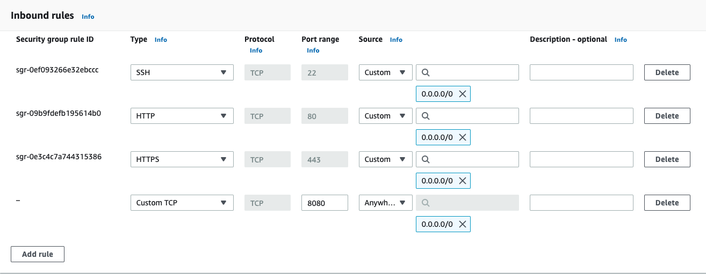

# Deploy on Amazon Elastic Compute Cloud

Follow the instructions in this guide to setup DronaHQ in self hosted environment on Amazon elastic computing cloud (EC2).

### Prerequisite

To deploy DronaHQ on Amazon EC2, you should have:
- `DronaHQ License Key`, which you can get from DronaHQ [Self Hosted Portal](https://studio.dronahq.com/selfhosted/login).
- Basic understanding of `AWS` and `Amazon EC2`.
- Working [AWS account](https://signin.aws.amazon.com/console) with [permissions](https://docs.aws.amazon.com/AWSEC2/latest/APIReference/ec2-api-permissions.html) to manage EC2.

Following are some references, which can help you sail through AWS EC2.
- [Best practices to protect your account's root user](https://docs.aws.amazon.com/accounts/latest/reference/best-practices-root-user.html)
- [Tutorial: Get started with Amazon EC2 Linux instances](https://docs.aws.amazon.com/AWSEC2/latest/UserGuide/EC2_GetStarted.html)
- [Granting required permissions for Amazon EC2 resources](https://docs.aws.amazon.com/AWSEC2/latest/APIReference/ec2-api-permissions.html)
- [Best practices for Amazon EC2](https://docs.aws.amazon.com/AWSEC2/latest/UserGuide/ec2-best-practices.html)
- [Amazon EC2 service quotas](https://docs.aws.amazon.com/AWSEC2/latest/UserGuide/ec2-resource-limits.html)
- [Connect to your Linux instance from Linux or macOS using SSH](https://docs.aws.amazon.com/AWSEC2/latest/UserGuide/connect-linux-inst-ssh.html)

### 1. Create EC2 instance

1. On AWS [EC2 dashboard](https://console.aws.amazon.com/ec2/), Click **Launch Instance**.

2. Name your instance, to identify it later.

3. Optionally you can add some Tags (e.g. `app = dronahq`). This makes it easier to find if you have a lot of instances.

4. Select `Ubuntu` AMI with ubuntu version `20.04` or higher and `64-bit (x84)` architecture.

5. Select an instance type of your choice with minimum configuration as `t3.medium`.

6. Create or Select `SSH key pair`, This will be needed to connect to the instance via SSH.

7. Ensure you select the same `VPC` that also includes the databases & API’s that you want to connect.

8. You can create new `Security Group` or choose existing one. Modify inbound rules and add ports `80`, `443`, `22` and `8080`, with sources set to `0.0.0.0/0` and `::/0`.
   
   You  can set sources as your internal network address which will make it available only on your internal network.

   

   We need to open ports `80` (http) and `443` (https) so you can connect to the server from a browser, as well as port `22` (ssh) so that you can ssh into the instance to configure it and run DronaHQ. By default on a vanilla EC2, DronaHQ will run on port `8080`.

9. Configure the storage volume to have at least `60 GiB` of general purpose SSD.

10. In the **Summary** section, click on **Launch Instance** to start your instance.

### 2. Connect to your Linux instance using an SSH client

Use the following procedure to connect to your Linux instance using an SSH client. If you receive an error while attempting to connect to your instance, see [Troubleshoot connecting to your instance](https://docs.aws.amazon.com/AWSEC2/latest/UserGuide/TroubleshootingInstancesConnecting.html).

#### Connect to your instance using SSH

1. In a terminal window, use the ssh command to connect to the instance. You specify the path and file name of the private key (.pem), the user name for your instance, and the public DNS name or IPv6 address for your instance. For more information about how to find the private key, the user name for your instance, and the DNS name or IPv6 address for an instance, see Locate the private key and set permissions and Get information about your instance. To connect to your instance, use one of the following commands.

   - (Public DNS) To connect using your instance's public DNS name, enter the following command.
      ```shell
      ssh -i /path/key-pair-name.pem instance-user-name@instance-public-dns-name
      ```
   - (IPv6) Alternatively, if your instance has an IPv6 address, to connect using your instance's IPv6 address, enter the following command.
      ```shell
      ssh -i /path/key-pair-name.pem instance-user-name@instance-IPv6-address
      ```

   You see a response like the following:
   ```
   The authenticity of host 'ec2-198-51-100-1.compute-1.amazonaws.com (198-51-100-1)' can't be established.
   ECDSA key fingerprint is l4UB/neBad9tvkgJf1QZWxheQmR59WgrgzEimCG6kZY.
   Are you sure you want to continue connecting (yes/no)?
   ```

2. (Optional) Verify that the fingerprint in the security alert matches the fingerprint that you previously obtained in (Optional) [Get the instance fingerprint](https://docs.aws.amazon.com/AWSEC2/latest/UserGuide/connect-to-linux-instance.html#connection-prereqs-fingerprint). If these fingerprints don't match, someone might be attempting a man-in-the-middle attack. If they match, continue to the next step.

3. Enter `yes`.

   You see a response like the following:
   ```
   Warning: Permanently added 'ec2-198-51-100-1.compute-1.amazonaws.com' (ECDSA) to the list of known hosts.
   ```

### 3. Download DronaHQ Self Hosted

There are two ways, you can download DronaHQ Self Hosted.

#### a. Cloning Git repository

To clone from git repository, run following command.

```shell
git clone https://github.com/dronahq/self-hosted.git dronahq-self-hosted
```

Above command will create new folder in your present working directory with name `dronahq-self-hosted`.

#### b. Download and extract compressed package from DronaHQ

To download compressed package from DronaHQ, run following command

```shell
curl -L -fsSL -o ./master.zip "https://license.dronahq.com/self-hosted/master.zip" && unzip master.zip && mv master dronahq-self-hosted
```

### 4. Change working directory

We have to change working directory to `dronahq-self-hosted` for playing with DronaHQ.

Use following command.

```shell
cd dronahq-self-hosted
```

### 5. Update resources

This is recommended step by DronaHQ. Updating your resources periodically will help you stay aligned with DronaHQ.

Run following command

```shell
/bin/bash -c "$(curl -fsSL https://license.dronahq.com/self-hosted/update_resources.sh)"
```

### 6. Setup Externalize databases

For deployment on `AWS EC2`, it is mandatory to setup external databases for both MYSQL and MONGODB. 

Please follow our guide on <a href="/self-hosted-deployment/configure-external-databases/" target="_blank">Configure external databases</a>.

### 6. Setup DronaHQ Environment

:::caution Warning
Running this script will clear your existing installation if you have any. It will setup completely new environment. It will create back of your current environment and storage directory with time stamp followed by file/folder name.
:::

To setup dronahq environment, you have to run `./dronahq_setup` already present in your working directory.

```shell
./dronahq_setup
```

### 7. Update environment variables

DronaHQ writes all configurable environment variables in file `dronahq.env`. Please make sure you have all mandatory variables are in place.

#### i. `LICENSE_KEY`
`LICENSE_KEY` is one of the mandatory and essential environment variable. please verify that you have it in `dronahq.env`.
If not you can add this variable. Following is the example of how this variable should look like in environment file.

```shell
LICENSE_KEY='DRONAHQ-LICENSE-KEY'
```

If you don't have DronaHQ license key for self hosted, you can [sign up](https://www.dronahq.com/self-hosted-signup/) for DronaHQ self hosted and get your license key by logging in to [self-hosted portal](https://studio.dronahq.com/selfhosted/login).

#### ii. `BUILDER_URL`

This variable specifies how do yo want to access DronaHQ.
- Protocol [ http/ https]
- Access domain [ Localhost/ IP address/ Domain Name] 

**Example 1**. If you are using DronaHQ on local machine.

```shell
BULDER_URL='http://localhost'
```

**Example 2**. If you have configured DronaHQ on server and want to use it with server's public IP address.

```shell
# replace your ip address here
BUILDER_URL='http://198.51.100.1'
```

**Example 3**. If you have mapped your domain name to server's IP address.

```shell
# replace your domain name
BUILDER_URL='http://dronahq.example.com'
```

#### iii. Database configuration variables

Configure variables for external MYSQL credentials

`MYSQL_HOST`, `MYSQL_USER`, `MYSQL_PASSWORD`, `MYSQL_PORT`

```shell
MYSQL_HOST='mysql.example.com'
MYSQL_USER='dronahq'
MYSQL_PASSWORD='secret-password'
MYSQL_PORT='3306'
```
Configure variables for external MONGODB credentials

`MONGODB_HOST`, `MONGODB_USER`, `MONGODB_PASSWORD`, `MONGODB_PORT`

```shell
MONGODB_HOST='mongodb.example.com'
MONGODB_USER='dronahq'
MONGODB_PASSWORD='secret-password'
MONGODB_PORT='27017'
```

#### iv. Optional environment variables
You can also checkout other optional [Environment Variables](/self-hosted-deployment/environment-variables.md), which can enable advance options for you to use DronaHQ Self Hosted.

### 8. Restart DronaHQ

You can apply all new changes in configuration, and restart DronaHQ simply by running following command.

```shell
sudo docker-compose up -d
```

### 9. Verify that containers are running

You can use following command to check running docker containers.

```shell
sudo docker-compose ps
```

It should look something like this


#### Hurray !!! Now you have working self hosted DronaHQ.