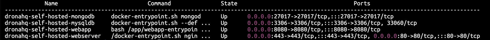

# Deploy on local Linux or MacOS machine

DronaHQ Self Hosted supports local installation on your Linux based OS or MacOS using [Docker](https://www.docker.com/).

:::info Attention
We recommend you to deploy DronaHQ Self Hosted on cloud hosted virtual machines such as [AWS EC2](./aws-ec2.md), [Azure VM](./azure.md), or [GCP Compute Engine](./gcp.md). Their hardware and operating systems are more standardized make it best fit for production use cases. If you are deploying DronaHQ on a physical machine then verify that your system is matching minimum criteria for network and storage [requirements](/self-hosted-deployment/requirements.md).
:::

### Prerequisite
To deploy DronaHQ on your local machine you should have:
- DronaHQ Self Hosted license key. you can get your license key from [Self Hosted Portal](https://studio.dronahq.com/selfhosted/login).
- Working installation of [Docker Desktop](https://docs.docker.com/desktop/).

### 1. Download DronaHQ Self Hosted

There are two ways, you can download DronaHQ Self Hosted.

#### a. Cloning Git repository

Prevent Git from automatically converting line endings between CRLF and LF, ensuring consistent handling across different platforms.

```shell
git config --global core.autocrlf false
```

To clone from git repository, run following command.

```shell
git clone https://github.com/dronahq/self-hosted.git dronahq-self-hosted
```

Above command will create new folder in your present working directory with name `dronahq-self-hosted`.

#### b. Download and extract compressed package from DronaHQ

To download compressed package from DronaHQ, run following command

```shell
curl -L -fsSL -o ./master.zip "https://license.dronahq.com/self-hosted/master.zip" && unzip master.zip && mv master dronahq-self-hosted
```

### 2. Change working directory

We have to change working directory to `dronahq-self-hosted` for playing with DronaHQ.

Use following command.

```shell
cd dronahq-self-hosted
```

### 3. Update resources

This is recommended step by DronaHQ. Updating your resources periodically will help you stay aligned with DronaHQ.

Run following command

```shell
/bin/bash -c "$(curl -fsSL https://license.dronahq.com/self-hosted/master/update_resources.sh)"
```
### 4. Setup DronaHQ Environment

:::caution Warning
Running this script will clear your existing installation if you have any. It will setup completely new environment. It will create back of your current environment and storage directory with time stamp followed by file/folder name.
:::

To setup dronahq environment, you have to run `./dronahq_setup` already present in your working directory.

```shell
./dronahq_setup
```

### 5. Update environment variables

DronaHQ writes all configurable environment variables in file `dronahq.env`. Please make sure you have all mandatory variables are in place.

#### i. `LICENSE_KEY`
`LICENSE_KEY` is one of the mandatory and essential environment variable. please verify that you have it in `dronahq.env`.
If not you can add this variable. Following is the example of how this variable should look like in environment file.

```shell
LICENSE_KEY='DRONAHQ-LICENSE-KEY'
```

If you don't have DronaHQ license key for self hosted, you can [sign up](https://www.dronahq.com/self-hosted-signup/) for DronaHQ self hosted and get your license key by logging in to [self-hosted portal](https://studio.dronahq.com/selfhosted/login).

#### ii. `BUILDER_URL`

This variable specifies how do yo want to access DronaHQ.
- Protocol [ http/ https]
- Access domain [ Localhost/ IP address/ Domain Name] 

**Example 1**. If you are using DronaHQ on local machine.

```shell
BUILDER_URL='http://localhost'
```
**Example 2**. If you have configured DronaHQ on server and want to use it with server's public IP address.

```shell
# replace your ip address here
BUILDER_URL='http://10.100.3.21'
```

**Example 3**. If you have mapped your domain name to server's IP address.

```shell
# replace your domain name
BUILDER_URL='http://dronahq.example.com'
```

#### iii. Other environment variables
You can also checkout other [Environment Variables](/self-hosted-deployment/environment-variables.md), which can enable advance options for you to use DronaHQ Self Hosted.

### 6. Restart DronaHQ

You can apply all new changes in configuration, and restart DronaHQ simply by running following command.

```shell
sudo docker compose up -d
```

### 7. Verify that containers are running

You can use following command to check running docker containers.

```shell
sudo docker compose ps
```

It should look something like this



#### Hurray !!! Now you have working self hosted DronaHQ.
