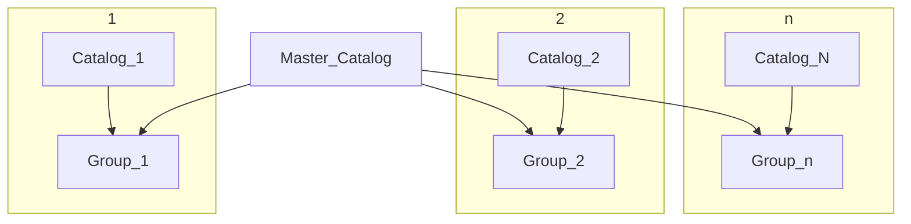

import Thumbnail from '@site/src/components/Thumbnail';
import VersionedLink from '@site/src/components/VersionedLink';

# User/Group based App Catalogs

App catalogs in DronaHQ is permission based app provisioning for user groups. This is generally used to provision apps that are visible to specific group of users in the DronaHQ `End-user portal`. For e.g. you might have apps specific to your sales staff and there would be a different set of apps for the product and engineering staff and a third set of apps for the customer support staff. 

:::caution Please Note

You need to have Administrator privileges to make changes to app catalogs.

:::

## Concept of App catalogs

To understand how to provision specific apps to specific group of users you need to understand the following concepts:
- Catalogs - A Catalog is a set of apps. You can assign a catalog to an app. You can assign only 1 catalog to a particular app. 
- Master Catalog - The apps added in this catalog are visible to everyone regardless of the group that they belong to. This catalog cant be deleted or edited.
- User Group - A user group is a set of users. You can assign a user to multiple groups. e.g. A user can exist in 2 groups `engineering` and `customer success`.
- Mapping of User groups to App catalogs - You can assign an App catalog to multiple groups. The master catalog is by default assigned to all users.

## Configuring App catalogs

You can navigate to the App catalogs section to do this configuration. You will see a list of your created app catalogs or you can create a new one. You can edit any existing app and assign the catalog to that app which you will see when you click on any of the catalogs that you click to see details. Interesting part is you can reorder all the apps in this catalog in the order in which you want your end users to see these apps. Also you can reorder the catalog list as well to make sure that your end-users are seeing the apps in the right order in the DronaHQ End-user portal. 

<figure>
  <Thumbnail src="/img/common/catalog-list.png" alt="Catalog list" width='100%'/>
  <figcaption align = "center"><i>Catalog listing</i></figcaption>
</figure>

<figure>
  <Thumbnail src="/img/common/catalog-list.png" alt="Catalog list" width='100%'/>
  <figcaption align = "center"><i>Assign catalogs to user groups</i></figcaption>
</figure>

<figure>
  <Thumbnail src="/img/common/reorder-catalogs.png" alt="Catalog reordering" width='100%'/>
  <figcaption align = "center"><i>Catalog reordering</i></figcaption>
</figure>